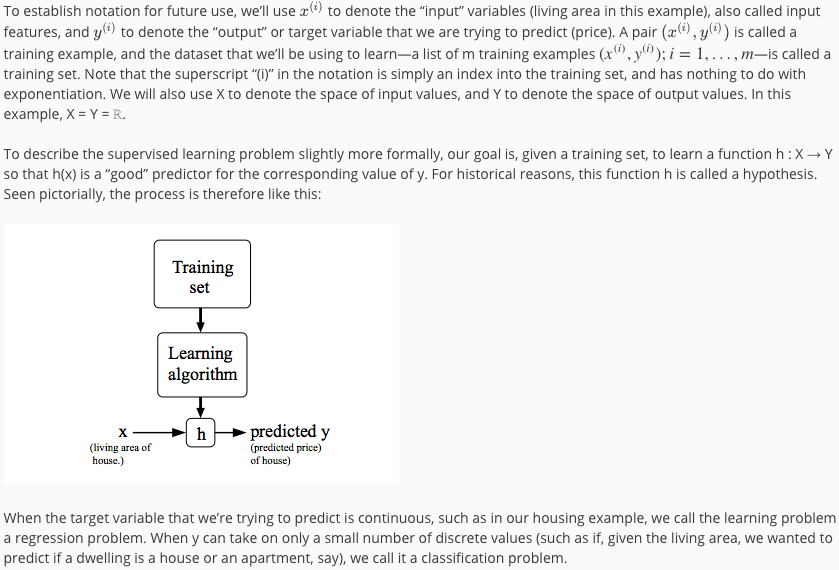
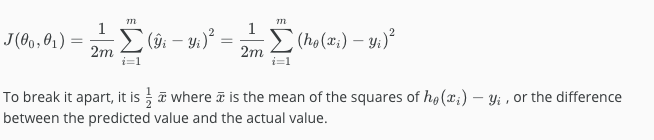
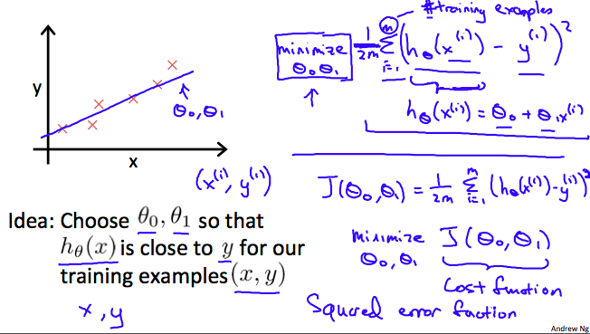

# Notes

# Introduction

## Welcome Video
* Machine Learning: The science of getting computers to learn without being explicitly programmed.

## What is Machine Learning? 
* Arthur Samuel (1959) – Machine Learning: Field of study that gives computers the ability to learn without being explicitly programmed.
  * Programmed checkers program that eventually beat Samuel 
* Tom Mitchell (1998) – Well-posed Learning Problem: A computer program is said to *learn* from experience **E** with respect to some task **T** and some performance measure **P**, if its performance on **T**, as measured by **P**, improves with experience **E**.  

## Supervised Learning
* In supervised learning, we are given a data set and already know what our correct output should look like, having the idea that there is a relationship between the input and the output.
* Supervised learning problems are categorized into "regression" and "classification" problems. In a regression problem, we are trying to predict results within a continuous output, meaning that we are trying to map input variables to some continuous function. In a classification problem, we are instead trying to predict results in a discrete output. In other words, we are trying to map input variables into discrete categories.

## Unsupervised Learning
* Unsupervised learning allows us to approach problems with little or no idea what our results should look like. We can derive structure from data where we don't necessarily know the effect of the variables.
* We can derive this structure by clustering the data based on relationships among the variables in the data.
* With unsupervised learning there is no feedback based on the prediction results.
* Cocktail Party Problem Algorithm `[W,s,v] = svd((repmat(sum(x.*x,1),size(x,1),1).*x)*x')`

# Linear Regression with One Variable (Univariate)

## Model Representation

 
## Cost Function 
* We can measure the accuracy of our hypothesis function by using a cost function. This takes an average difference (actually a fancier version of an average) of all the results of the hypothesis with inputs from x's and the actual output y's.

* 

* This function is otherwise called the "Squared error function", or "Mean squared error". The mean is halved (1/2) as a convenience for the computation of the gradient descent, as the derivative term of the square function will cancel out the 1/2 term. The following image summarizes what the cost function does:     

